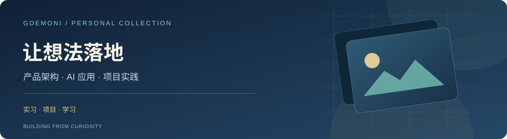

<b>你好，我是 Gdemoni。</b> 软件工程专业在读，把对 AI 和工具的好奇心做成可以使用的项目。

  <a href="#为什么创建-pieces-lab">为什么创建</a> ·
  <a href="#我的初心">我的初心</a> ·
  <a href="#关于我">关于我</a> ·
  <a href="#代表作品">代表作品</a> ·
  <a href="#项目陈列室">项目陈列室</a> ·
  <a href="#学习与记录">学习与记录</a> ·
  <a href="#联系我">联系我</a>

  <a href="https://zshgdemoni.me/">个人网站</a> ·
  <a href="https://github.com/gdemoni">GitHub</a> ·
  <a href="mailto:zhang2718827630@gmail.com">邮箱</a>

## 为什么创建 Pieces Lab

互联网让越来越多人拥有自己的个人网站，用来记录经历、展示作品和表达想法。我看到网上有许多这样的创作者，却缺少一个能集中发现彼此的地方，于是想到创建 Pieces Lab。我希望把大家的个人网站尽可能收集在一起，让成员的作品互相连接，并主动介绍、宣传这些网站，让更多人看见他们的创作。

## 我的初心

我一直对 AI、编程和新工具保持好奇，也常有想亲手实现的点子。我想从真实问题出发，做出能被人使用的东西，同时留下尝试、遇到的问题和学到的经验。

## 关于我

我是一名软件工程专业的大三学生，目前在探索自己愿意长期投入的方向。2026 年 5 月至 9 月，我在上海七牛信息技术有限公司产品架构部实习，担任五人小组组长，负责 Askio 运维排障 AI 助手的架构设计、技术选型与 Agent 核心实现。

除了团队项目，我还做了课程教学数字人、多 Agent 旅行助手和自建域名邮箱。这里介绍我的职责与实践过程；更完整的个人记录在 [zshgdemoni.me](https://zshgdemoni.me/)。

## 代表作品

### Askio · 运维排障 AI 助手｜产品架构实习

**上海七牛信息技术有限公司 · 产品架构部｜2026.05—2026.09｜五人小组组长**

Askio 针对运维排障中的三个难点：长对话里的排查方向难追踪，指标、日志和 Trace 证据分散，过往经验难以复用。我们用可分叉与汇聚的调查图组织排查，让 Agent 并行取证，并允许用户在过程中打断和纠偏。

我主导整体架构与技术选型，并负责 Agent 核心链路：将调查建模为“根节点 → 排查节点 → 故障域”，接入指标、日志与 Trace 工具；将完成的调查沉淀为“故障现象 → 故障域 → 排障思路”，通过 RAG 召回相似经验，再用当前数据验证。系统以事件协调调查图变更、工具调用和审批，通过 SSE 向前端推送进展。

**[Askio 官网 ↗](https://www.askio.site/)** · [项目与实习详情](projects/askio.md)

## 项目陈列室

| 项目 | 在做什么 | 方向 / 状态 |
| --- | --- | --- |
| [Askio](projects/askio.md) | 用调查图、Agent 取证与经验检索辅助运维排障；负责架构设计和 Agent 核心实现。 | 产品架构 · 实习项目 |
| [EduAvatar](https://github.com/gdemoni/EduAvatar) | 将课程检索、分场景讲解、语音合成和唇形同步串成数字人教学流程。 | AI 教学 · 项目实践 |
| [Travel Agent](https://github.com/gdemoni/agent_ctrip_assistant) | 用主助理与四个领域助理处理旅行需求，修改类操作先等待用户确认。 | 多 Agent · 后端开发中 |
| [Gdemoni Mail](https://github.com/gdemoni/cloud-mail) | 基于开源 Cloud Mail 部署和维护自己的域名邮箱。 | 开源部署 · 持续维护 |

**[查看我的更多仓库 ↗](https://github.com/gdemoni?tab=repositories)**

## 学习与记录

我会把感兴趣的想法做成项目，也记录其中的设计取舍和实现过程。[EduAvatar 项目 Wiki](https://github.com/gdemoni/EduAvatar/wiki)整理了课程数字人的搭建步骤；[个人网站](https://zshgdemoni.me/)继续收录项目、文章与成长经历。

## 技术与工具

<code>Python</code> <code>FastAPI</code> <code>LangGraph / LangChain</code> <code>RAG</code> <code>FAISS</code> <code>NestJS / Fastify</code> <code>PostgreSQL / pgvector</code> <code>Redis / BullMQ</code> <code>Cloudflare Workers</code>

以上是项目与实习中接触的技术；TypeScript、Java 和 Go 仍在持续学习。

## 联系我

- 个人网站：[zshgdemoni.me](https://zshgdemoni.me/)
- GitHub：[@gdemoni](https://github.com/gdemoni)
- X：[@Gdemonizsh](https://x.com/Gdemonizsh)
- 邮箱：[zhang2718827630@gmail.com](mailto:zhang2718827630@gmail.com)
- 社区：[Pieces Lab](https://github.com/Pieces-lab)

<b>关于这个作品集仓库</b>

这是我在 Pieces Lab 的个人展示空间，按[个人模板](https://github.com/Pieces-lab/Peronal-Template)整理了介绍、代表作品、项目与联系方式。Askio 的实习与项目内容见 [projects/askio.md](projects/askio.md)；其他项目的代码和详细说明以各自仓库为准。封面来源见 [ATTRIBUTION.md](ATTRIBUTION.md)。

---

<b>把好奇心做成可以使用的东西。</b> GDEMONI / A PERSONAL COLLECTION · PIECES LAB

